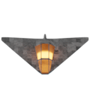
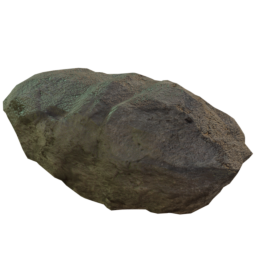
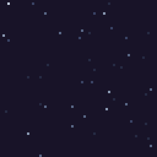
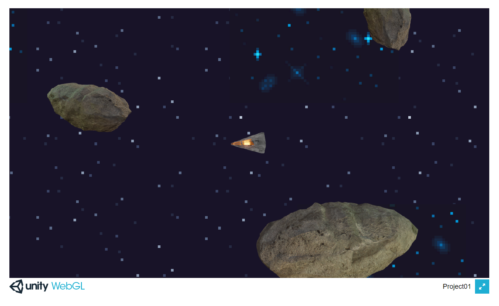

# Lesson: Digital & Serious Games

### First and Last Name: Daniele Charasanakis
### University Registration Number: dpsd18129
### GitHub Personal Profile: DaniXks
### Digital & Serious Games Personal Repository: https://danixks.github.io/Role-Playing-Game/

# Δημιουργία Space-Exploration-Game

Προς το παρόν δεν υπάρχει κάποιος συγκεκριμένος σκοπός. Ο παίκτης απλά εξερευνεί το περιβάλλον και προσπαθεί να καταλάβει τι συνέβει στο παρελθόν.

# 1st Deliverable

Παλιότερα είχα φτιάξει ένα απλό 3D διαστημόπλοιο στο Blender και το χρησιμοποίησα γι αυτό το παιχνίδι. Έκανα 8 renders σε ανάλυση 128 x 128 από 8 διαφορετικές όψεις για να ταιριάζει με την κίνηση του παίκτη.

Έπειτα χρησιμοποίησα και άλλα 2 renders κάποιων αστεροειδών για το decoration. 

Και μετά κάποια έτοιμα tiles από το itch.io για το background.

Αυτό είναι το αποτέλεσμα προς το παρόν:

# 2nd Deliverable
Το παιχνίδι τώρα αρχίζει να φαίνεται όπως το είχα αρχικά στο μυαλό μου. Τα tiles για τα αστέρια έχουν αντικατασταθεί με ένα Procedural voronoi texture το οποίο έφτιαξα μέσα στο Shader Graph και το οποίο με διάφορες τροποποιήσεις "δημιουργεί" αστέρια.
Το parallax effect γίνεται "scrollάροντας" τα UV αυτών των texture, με 3 διαφορετικές ταχύτητες, προς την αντίθετη κατεύθυνση που κινείται το διαστημόπλοιο.

Το ίδιο περίπου συμβαίνει και με τον ήλιο και τον πλανήτη, μόνο που αυτά δεν "scrollάρουν", απλά μετακινούνται.

Οι αστεροιειδής τώρα έχουν collisions και υπάρχουν και διάφορα collectibles τα οποία δίνουν ζωή στον παίκτη ή του αυξάνουν την ταχύτητα.

Τώρα υπάρχει και ένα βασικό UI το οποίο δείχνει τις ζωές του παίκτη, την ταχύτητά του, και τις συντεταγμένες του.

Και φυσικά υπάρχει και το animation με τις φλόγες το οποίο είναι αρκετά "έξυπνο" ώστε να καταλάβει πότε το διαστημόπλοιο επιταχύνει, πότε έχει πιάσει την μέγιστη ταχύτητα κτλ.
Και αν ο παίκτης πεθάνει, γίνεται έκρηξη και το παιχνίδι ξαναξεκινάει αυτόματα.

Τέλος, υπάρχει και ένα soundtrack το οποίο είχα φτιάξει το 2020 στον ελεύθερό μου χρόνο. Νομίζω ότι ταιριάζει.

# 3rd Deliverable 

# Conclusions

# Sources
