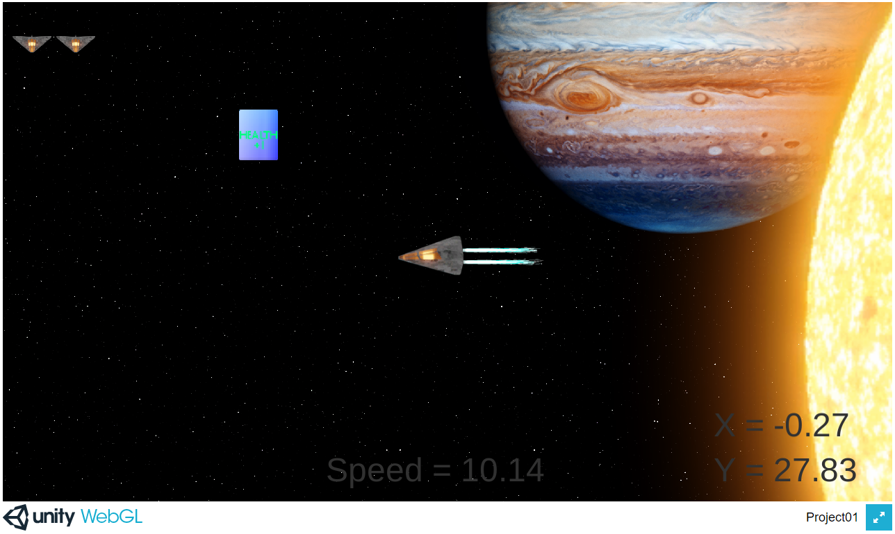
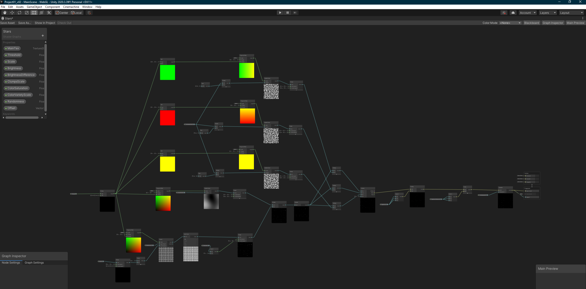
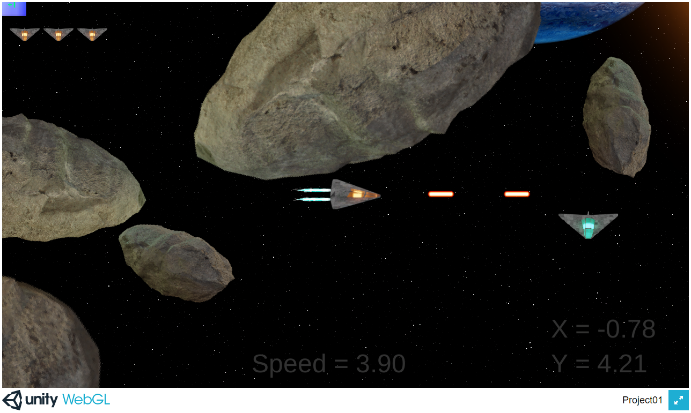
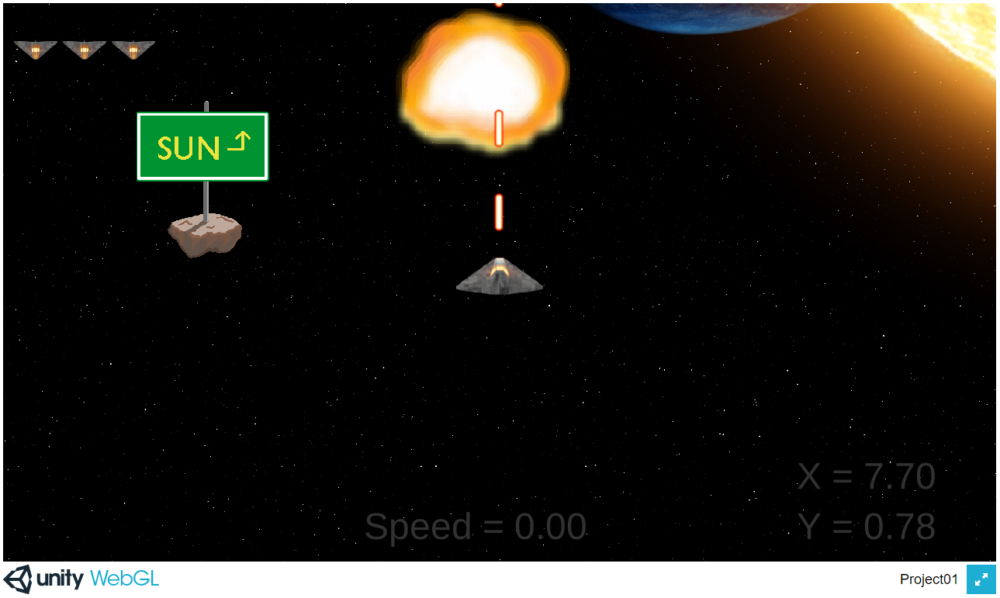
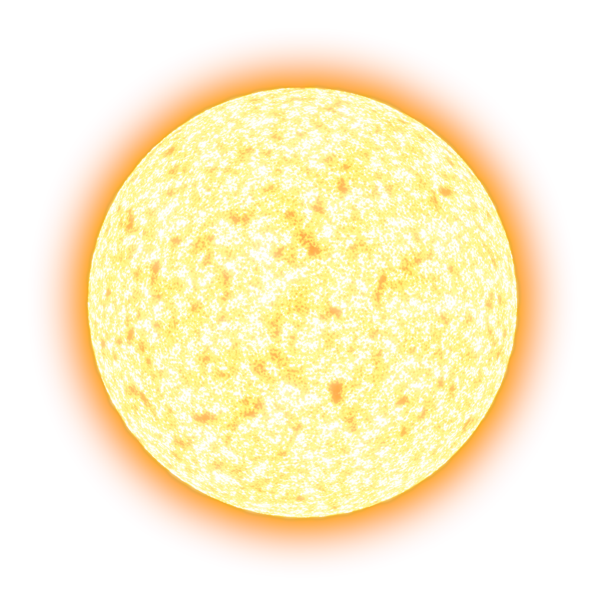
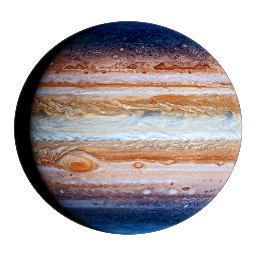
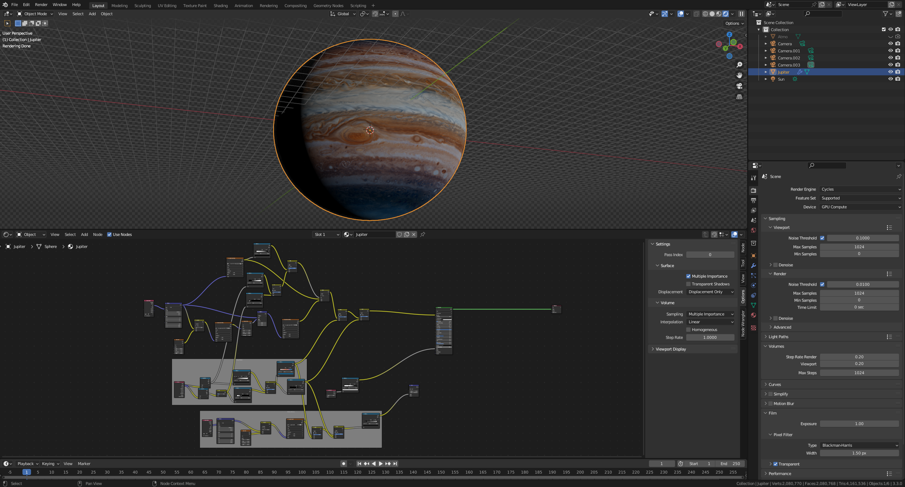
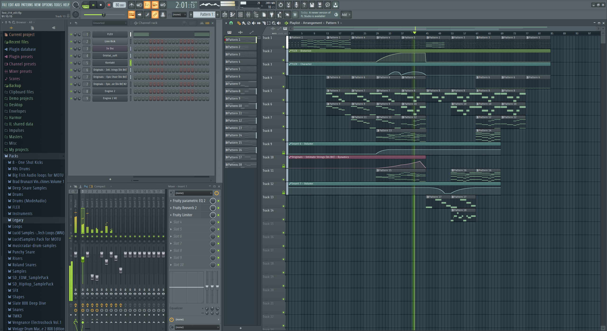

# Lesson: Digital & Serious Games

### First and Last Name: Daniele Charasanakis
### University Registration Number: dpsd18129
### GitHub Personal Profile: DaniXks
### Digital & Serious Games Personal Repository: https://danixks.github.io/Role-Playing-Game/

# Δημιουργία Space-Exploration-Game

Προς το παρόν δεν υπάρχει κάποιος συγκεκριμένος σκοπός. Ο παίκτης απλά εξερευνεί το περιβάλλον και προσπαθεί να καταλάβει τι συνέβει στο παρελθόν.

# 1st Deliverable

Παλιότερα είχα φτιάξει ένα απλό 3D διαστημόπλοιο στο Blender και το χρησιμοποίησα γι αυτό το παιχνίδι. Έκανα 8 renders σε ανάλυση 128 x 128 από 8 διαφορετικές όψεις για να ταιριάζει με την κίνηση του παίκτη.

Έπειτα χρησιμοποίησα και άλλα 2 renders κάποιων αστεροειδών για το decoration. 

Και μετά κάποια έτοιμα tiles από το itch.io για το background.

Αυτό είναι το αποτέλεσμα προς το παρόν:

# 2nd Deliverable
Το παιχνίδι τώρα αρχίζει να φαίνεται όπως το είχα αρχικά στο μυαλό μου.

Τα tiles για τα αστέρια έχουν αντικατασταθεί με ένα Procedural voronoi texture το οποίο έφτιαξα μέσα στο Shader Graph και το οποίο με διάφορες τροποποιήσεις "δημιουργεί" αστέρια.

Το parallax effect γίνεται "scrollάροντας" τα UV αυτών των texture, με 3 διαφορετικές ταχύτητες, προς την αντίθετη κατεύθυνση που κινείται το διαστημόπλοιο.
Το ίδιο περίπου συμβαίνει και με τον ήλιο και τον πλανήτη, μόνο που αυτά δεν "scrollάρουν", απλά μετακινούνται.

Οι αστεροιειδής τώρα έχουν collisions και υπάρχουν και διάφορα collectibles τα οποία δίνουν ζωή στον παίκτη ή του αυξάνουν την ταχύτητα. 
Με το πλήκτρο "Space" το διαστημόπλοιο τώρα εκτοξεύει Laser (το οποίο λαμβάνει υπόψη την κατεύθυνση και την ταχύτητα του διαστημόπλοιου) ενώ με το "Left-Ctrl" μηδενίζεται η ταχύτητα του διαστημόπλοιου. 

Τώρα υπάρχει και ένα βασικό UI το οποίο δείχνει τις ζωές του παίκτη, την ταχύτητά του, και τις συντεταγμένες του. Με τις συντεταγμένες τώρα θα μπορεί ο παίκτης να πλοηγηθεί χωρίς να χάνεται και να βρίσκει τα διάφορα μέρη που έχουν σημασία για την πρόοδό του στο παιχνίδι.

Επίσης, υπάρχει και ένας εχθρός που κινείται δεξιά-αριστερά (προς το παρόν) ο οποίος μπορεί να καταστραφεί με το Laser αλλά και αφαιρεί μία ζωή από τον παίκτη και τον ίδιο του τον εαυτό αν τρακάρουν. Ο ήλιος επίσης αφαιρεί ζωές αν πετάτε κοντά του.

Και φυσικά υπάρχει και το animation με τις φλόγες το οποίο είναι αρκετά "έξυπνο" ώστε να καταλάβει πότε το διαστημόπλοιο επιταχύνει, πότε έχει πιάσει την μέγιστη ταχύτητα κτλ.
Και αν ο παίκτης πεθάνει, γίνεται έκρηξη και το παιχνίδι ξανα-ξεκινάει αυτόματα.

Έπειτα τα sprites για τον ήλιο και τον πλανήτη (βασισμένο στον Δία) φτιάχτηκαν και έγιναν render μέσα στο Blender.

Τέλος, υπάρχει και ένα soundtrack το οποίο είχα φτιάξει το 2020 στον ελεύθερό μου χρόνο. Νομίζω ότι ταιριάζει.

# 3rd Deliverable
Τώρα υπάρχει ένα menu όπου ο παίκτης μπορεί και να επιλέξει το location από το οποίο θα ξεκινήσει.
Έχει δικό του soundtrack το οποίο το είχα φτιάξει και αυτό παλιότερα.

Το διαστημόπλοιο τώρα αφήνει πίσω του particles με trails. 
Τα "Speed PowerUps" αφαιρέθηκαν και στη θέση τους τώρα ο πάικτης μπορεί να ενεργοποιήσει το StringDrive με το αριστερό πλήκτρο "Shift".
Έτσι η ταχύτητα και η επιτάχυνση του διαστημοπλοίου αυξάνεται και η συμπεριφορά των particles αλλάζει και γίνεται πιο έντονη.

Τα projectiles τώρα δεν εξαφανίζονται πια ανάλογα με την απόσταση από το spawn point αλλά ανάλογα με τη θέση του παίκτη.
Επίσης, τώρα κάνουν ήχο και αφήνουν particles όταν τρακάρουν με κάτι.

Με το πλήκτρο "Ζ" ο παίκτης μπορεί να ανοίξει ένα "Portal" το οποίο του επιτρέπει να επιστρέψει στις συντεταγμένες 0, 0.
Ο ήχος για το Portal είναι επήτηδες σχεδιασμένος για να ταιριάζει με το soundtrack.
Γενικά, όλοι οι ήχοι είναι φτιαγμένοι από το μηδέν για το παιχνίδι.

Και με το πλήκτρο "Χ" ο παίκτης μπορεί (χάρη σε RayCast) να ανοίξει ένα dialog στις πινακίδες και να διαβάσει σχετικές πληροφορίες.

Τέλος, όλα τα "Text" για το UI έχουν αναβαθμιστεί σε TextMeshPro για να γίνουν πιο όμορφα.

# Conclusions

# Sources
