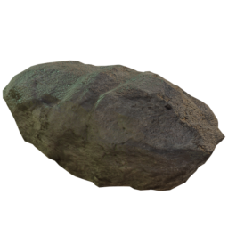
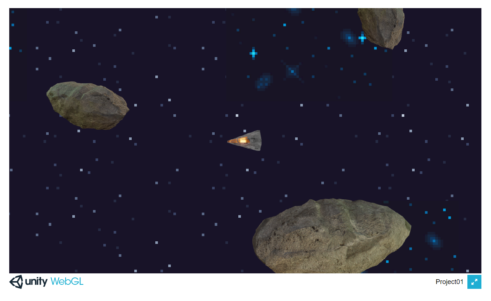

# Δημιουργία Space-Exploration-Game

Προς το παρόν δεν υπάρχει κάποιος συγκεκριμένος σκοπός. Ο παίκτης απλά εξερευνεί το περιβάλλον και προσπαθεί να καταλάβει τι συνέβει στο παρελθόν.

Παλιότερα είχα φτιάξει ένα απλό 3D διαστημόπλοιο στο Blender και το χρησιμοποίησα γι αυτό το παιχνίδι. Έκανα 8 renders σε ανάλυση 128 x 128 από 8 διαφορετικές όψεις για να ταιριάζει με την κίνηση του παίκτη.

Και μετά κάποια έτοιμα tiles από το itch.io για το background.

Αυτό είναι το αποτέλεσμα προς το παρόν:

